# Numerica Combo Game

Una versión del [juego original](https://github.com/rothiotome/numerica-twitch) de @rothiotome
para jugar en el chat de Twitch. Basado en el [código](https://github.com/JavierBalonga/numerica-game) de @altaskur

## 🎮 ¿Cómo jugar?

¿Te encantó el numerica original? ¿Te gustaría una versión en donde no solo puedas sumar uno a uno, sino que también puedas sumar dos, tres, cuatro o más números? ¡Entonces este es tu versión del juego!

Para jugar, escribe en el chat de Twitch el número que quieres contar. Por ejemplo, si quieres sumar 1, 2 y 3, escribe `1`, luego `2` y luego `3` como en la versión original. 

Existen emotes en donde puedes agregar un Combo al siguiente número. Por ejemplo, si estás en el número 5 y quieres sumarle 2, puedes colocar uno de los emotes que incrementará el combo y por lo cual el número siguiente será 7. 

Con esto se incrementará el HightScore más rápido. Pero ojo, no dura mucho tiempo. Así que date prisa y suma muchos puntos.

Estos son los emotes que puedes usar para incrementar el combo:

-  `rothioStabanim`
- 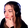 `afordiThinking`
- 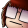 `psuzumPokerface`
-  `ildesiChurro`
-  `altaskCode`
- 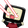 `meleni4CABREADO`
- 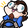 `algebr3Driver`
- 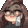 `carmen67Jeje`
- 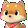 `sensei9Facepalm`
- 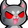 `catisa1Demon`
-  `ransilMAL`
- 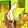 `niv3keTodook`
-  `isaacs1Leak`
- 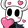 `papajo8Heart`
- 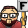 `kerk11F`
- 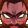 `lascosJoserragetotal`
  

## 🔧 ¿Como configurar?

Para configurar el juego tienes dos opciones accediendo desde [la web](https://numerica-combo-game.vercel.app/).

La primera es escribiendo el nombre del canal en donde quieres que se ejecute el juego. Por ejemplo, si quieres que se ejecute en tu canal, escribe tu nombre de usuario de Twitch. Y luego presiona el botón de "Start game".

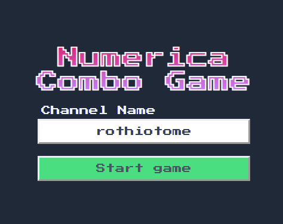

La segunda opción es en la URL del sitio web, puedes agregar `/channel/<YOUR_CHANNEL_NAME>` y luego presionar enter.

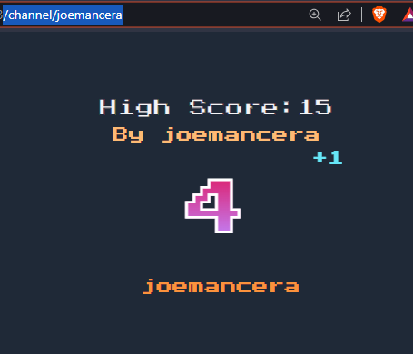

Si quieres agregarlo a tu escena de OBS, esta puede ser una buena opción. Puedes colocar la siguiente configuración.

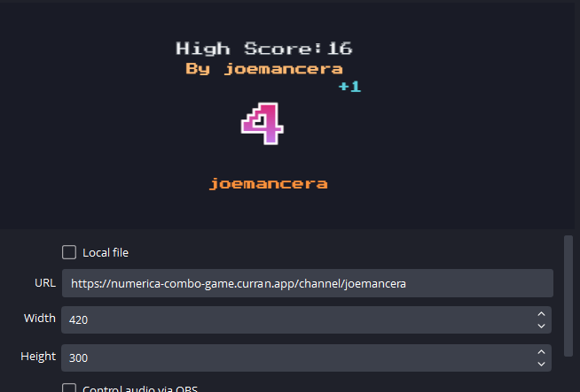